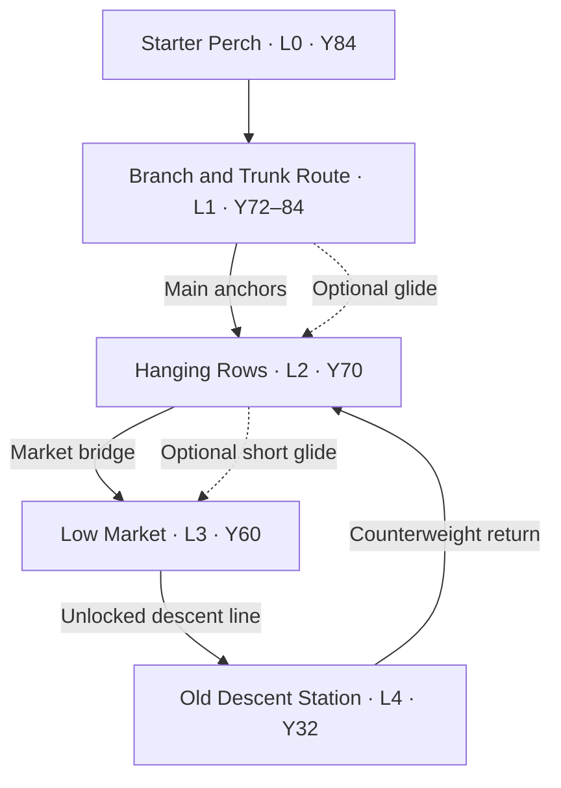
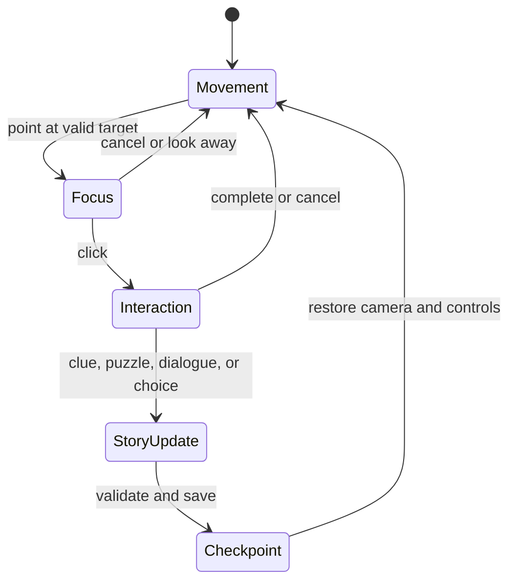

# Across The Canopy — Greybox Vertical Slice Specification

Status: implementation contract
Slice title: **The Upward Signal**
Scope: one complete authored route inside the infinite forest alpha
Target experience: first-person, point-and-click 3D adventure with parallel keyboard traversal

## 1. Greybox contract

This slice turns the existing forest alpha into one complete playable story loop. The procedural forest remains the background, atmosphere, and 1,000+ tree streaming test. It must not choose the authored route, place story objects, or obstruct the authored play space.

The inhabited canopy has no conventional visible ground. Every playable surface is a branch, trunk, suspended platform, hanging row, market deck, cable, or station structure. Fog and canopy occlusion hide depths below the Old Descent Station.

### Player contract

- Perspective: first person.
- Default FOV: `78`; player-adjustable from `60` through `120`.
- Primary interaction: point at a highlighted object and left-click.
- Point-and-click movement: clicking a green destination or blue traversal node moves the player to it along a validated path.
- Parallel traversal: `WASD` remains available; keyboard and click movement update the same player state.
- Dialogue: left-click or `Space` advances one line; the final line returns to movement.
- Cancel: `Escape` or right-click leaves focus, inspection, dialogue, puzzle, and journal modes safely.
- Inspection: temporarily frames the selected object, preserves the previous camera transform, and restores it on exit.
- Unavailable action: the target remains identified and explains the unmet condition; it never silently ignores input.
- Save: every completed story beat and the final choice writes the same versioned state schema.

### Success, recovery, and completion

- **Success:** reach the Old Descent Station, verify the fresh signal, make either final choice, return to the Hanging Rows, see the resulting world state, finish Sela's response, and save.
- **Recovery:** a fall, red boundary crossing, or invalid traversal returns the player to the latest safe cyan checkpoint with story state intact.
- **Failure:** this slice has no death or irreversible failure. Puzzle errors reset only the puzzle, and unavailable choices state why they are unavailable.
- **Completion:** `return_dialogue_complete=true`, a branch-specific journal entry is present, and checkpoint `atc:checkpoint/slice-complete` has been saved.

## 2. World coordinate contract

- Units: one Three.js world unit equals approximately one meter.
- Axes: `+X` east, `+Y` up, and `-Z` forward along the main route.
- Authored-region bounds: `X -32..72`, `Y 18..96`, `Z -128..68`.
- Procedural exclusion volume: the forest generator may surround but may not place trunks, rocks, terrain, or collision geometry inside the authored-region bounds.
- Lowest playable elevation: `Y 22`; everything below `Y 18` is a red recovery boundary.
- Fog and canopy occlusion must prevent any conventional ground plane from being visible.
- Initial camera position: `(0, 86, 56)`.
- Initial look target: `(0, 85, 43)`.

### Route map



### Authored locations

| Location ID | Center and bounds | Elevation | Entries | Exits | Safe-zone state | Landmarks, triggers, and boundaries |
| --- | --- | --- | --- | --- | --- | --- |
| `atc:location/starter-perch` | Center `(0,84,48)`; `X -10..10`, `Y 82..90`, `Z 34..62` | L0, high canopy | Spawn `(0,86,56)` | Main branch `(0,85,34)` | Checkpoint only | Echo spindle `(3,85.2,47)`, Sela `(-4,85,45)`, cyan start marker, red edge recovery outside platform bounds |
| `atc:location/trunk-route` | Center `(6,78,8)`; `X -18..24`, `Y 70..86`, `Z -14..36` | L1, upper trunk | South anchor `(0,84,32)` | East Rows entry `(8,72,-12)`; west glide entry `(-8,72,-14)` | No | Split trunk landmark `(12,78,4)`, crew notch `(13,78.2,5)`, main anchors, optional high-glide launch, red fall volume below `Y66` |
| `atc:location/hanging-rows` | Center `(8,70,-24)`; `X -14..28`, `Y 66..76`, `Z -42..-10` | L2, inhabited canopy | East `(8,72,-12)`; west glide `(-8,72,-14)`; return lift `(6,71,-18)` | Market bridge `(18,68,-40)`; market glide `(4,70,-40)` | Yes | Green lantern canopy, hanging food rows, failing lantern `(4,72.5,-24)`, cyan checkpoint `(8,71,-20)` |
| `atc:location/low-market` | Center `(28,60,-60)`; `X 8..44`, `Y 56..66`, `Z -80..-42` | L3, lower hub | Bridge `(18,64,-44)`; glide landing `(14,61,-52)` | Descent lock `(38,59,-76)`; return bridge `(18,64,-44)` | Yes while market lamps are active | Market board `(24,62,-58)`, three-dial lock `(31..35,61,-64)`, station cable landmark, red shutter until puzzle completion |
| `atc:location/old-descent-station` | Center `(50,32,-105)`; `X 38..66`, `Y 26..40`, `Z -120..-90` | L4, service depth | Zipline landing `(46,36,-96)` | Counterweight return `(44,35,-94)`; blocked deep shaft `(56,24,-116)` | No; return checkpoint only | Station console `(50,34,-109)`, beacon `(47.5,33,-111)`, sun-cell `(52.5,33,-111)`, deep red boundary below `Y18` |

### Traversal routes

| Route ID | Mode | Exact path | Availability |
| --- | --- | --- | --- |
| `atc:route/starter-branch` | Walk or click-to-move | `(0,86,56)` → `(0,85,42)` → `(0,84,32)` | Always |
| `atc:route/trunk-switchback` | Walk and assisted climb | `(0,84,32)` → `(8,82,22)` → `(16,78,10)` → `(13,75,-2)` → `(8,72,-12)` | Always; primary route |
| `atc:route/high-glide` | Short glide | Launch `(-5,79,9)` → apex `(-8,76,-2)` → landing `(-8,72,-14)` | Always; optional alternate after movement tutorial |
| `atc:route/rows-market-bridge` | Walk and climb | `(8,72,-12)` → `(18,68,-40)` → `(22,64,-50)` → `(28,61,-56)` | Always; primary route |
| `atc:route/rows-market-glide` | Short glide | Launch `(4,70,-40)` → `(8,66,-46)` → landing `(14,61,-52)` | Always; optional alternate |
| `atc:route/descent-line` | Gravity zipline | Start `(38,59,-76)` → `(42,50,-84)` → `(46,42,-91)` → landing `(46,36,-96)` | Locked until the dial puzzle is solved |
| `atc:route/station-return` | Counterweight lift and short walk | Lift `(44,35,-94)` → `(32,52,-66)` → Rows dock `(6,71,-18)` | Available after either final choice; cannot strand the player |

The main route is authored and readable, but the two optional glide links let the player approach the safe zone and market from different angles. Narrative pressure comes from the repeating signal and failing Rows lights, not invisible corridor walls.

## 3. Primitive language

| Color | Hex | Meaning | Rendering rule |
| --- | --- | --- | --- |
| Gray | `#7B8087` | Structural world geometry | Matte; no emissive pulse |
| Blue | `#2D8CFF` | Traversal route or movement affordance | Brightens on valid target; directional pulse when active |
| Green | `#35C76F` | Safe zone or valid destination | Soft steady emission; checkpoint ring when entered |
| Yellow | `#FFD23F` | Interactable object | Thin hover outline; solid outline on focus |
| Orange | `#FF8A2A` | Story clue or objective | Slow emissive pulse until recorded |
| Purple | `#A767E5` | NPC or character | Outline only while targetable; never used for scenery |
| Red | `#E5484D` | Hazard, blocked route, or recovery boundary | Warning pulse; contact invokes recovery rather than death |
| Cyan | `#32D5FF` | Spawn, trigger, or state transition | Visible in debug mode; brief ring in player mode |

Every authored primitive keeps its stable object ID when replaced by final art. Gameplay logic targets IDs and roles, never mesh names, colors, or geometry types.

## 4. Interaction flow



| State | Required behavior | Safe exit |
| --- | --- | --- |
| Movement | WASD and click destinations move one player entity; collision blocks gray/red geometry | Click target or open journal |
| Focus | Reticle, outline, object label, and available verb appear within range and line of sight | Look away, right-click, or `Escape` |
| Inspection | Camera eases to an authored inspection transform; object can rotate only when allowed | Restore the exact prior camera and movement state |
| Dialogue | Speaker name, concise text, and advance prompt remain readable over the 3D view | Final line, right-click, or `Escape`; state advances only on completed required lines |
| Puzzle | Three dials accept individual clicks; incorrect submission explains and resets | `Escape` preserves discovered clue and returns to movement |
| Traversal | Input is temporarily scoped to cancel/look; camera follows the authored route | End node restores standard movement; cancellation returns to start node |
| Choice | Both consequences are stated before confirmation | Cancel returns to the station console; confirmation is saved immediately |
| Journal | Shows objectives, clues, and consequence without changing the world | `J`, right-click, or `Escape` |

## 5. Story

### Premise and purpose

Ryn is a nomadic courier and route-mender. They repair shared paths, deliver messages, and move on before any settlement becomes home. Seven years ago, Ryn's mentor Edda disappeared below the inhabited canopy while serving at the Old Descent Station. Sela Oren, the station's former engineer and current keeper of the Hanging Rows, closed the route after the loss.

At the Starter Perch, Ryn finds an echo spindle that has climbed against the prevailing wind. It contains Edda's private identity knot and a transmission only three days old. The signal points toward the sealed station. At the same time, the Hanging Rows have only one night of stored light. The abandoned station's sun-cell could power that safe zone for a season, but it is also the only power source strong enough to answer the signal.

The slice asks one question: **how much communal safety should Ryn trade for uncertain truth?**

### Complete playable sequence and dialogue

#### Beat 1 — Start at the Starter Perch

Player action: activate `atc:trigger/spawn/starter-perch`, look around, and use one movement destination.

> **Ryn:** I trade routes, repair markers, and leave before any perch starts calling me theirs.
> **Ryn:** Edda taught me that. Then she went below.

State: `tutorial_movement_complete=true`.

#### Beat 2 — Inspect the echo spindle

Player action: target and inspect `atc:story/echo-spindle`.

> **Ryn:** This spindle is climbing against the wind.
> **Recorded voice:** Ryn—old station—don't let the line—
> **Ryn:** Edda's knot. Fresh wax. Three days old.

Journal: **A voice bearing Edda's private knot came from the sealed descent route.**

State: `spindle_inspected=true`; objective becomes **Ask Sela about the spindle**.

#### Beat 3 — Speak with Sela

Player action: talk to `atc:npc/sela-oren`.

> **Sela:** That is Edda's knot.
> **Ryn:** You said the descent crew vanished.
> **Sela:** I said the station closed. Some truths keep people alive.
> **Ryn:** This truth is three days old.
> **Sela:** Then either Edda lives, or something below learned her hands.
> **Sela:** The Rows have one night of light left. Bring back the station's sun-cell.
> **Ryn:** And if the cell can answer her?
> **Sela:** Then you will finally know what your answer costs.

State: `sela_warning_heard=true`; objective becomes **Follow the old crew route**.

#### Beat 4 — Cross the trunk and discover the crew notch

Player action: follow the blue switchback or optional glide, then inspect `atc:clue/crew-notch`.

> **Ryn:** Old descent-crew marks. Split Bough. Lantern. Open Ring.
> **Ryn:** Edda made me repeat route codes until I could see them with my eyes closed.

Journal clue: **Split Bough → Lantern → Open Ring**.

State: `crew_code_recorded=true`.

#### Beat 5 — Understand the Hanging Rows

Player action: enter the green safe zone and inspect `atc:interact/rows-lantern` among the lit hanging food rows.

> **Rows gauge:** LIGHT RESERVE: ONE NIGHT
> **Ryn:** Food keeps people here. Light lets them believe here is safe.
> **Ryn:** The station cell could buy the Rows a season.

State: `rows_need_known=true`; cyan checkpoint `atc:checkpoint/hanging-rows` is saved.

#### Beat 6 — Read the Low Market route board

Player action: reach the market by bridge or glide and inspect `atc:clue/market-route-board`.

> **Route board:** DESCENT CREW — SPLIT BOUGH / LANTERN / OPEN RING
> **Ryn:** The notch was not a warning. It was the lock combination.

State: `market_board_read=true`; objective becomes **Open the descent lock**.

#### Beat 7 — Solve the point-and-click lock

Player action: click each yellow dial until it shows the recorded sequence, then click the center submit plate.

Incorrect submission:

> **Lock:** ROUTE NOT RECOGNIZED
> **Ryn:** Not that order. The trunk mark is in my journal.

Correct submission:

> **Lock:** CREW ROUTE RECOGNIZED
> **Ryn:** Down is cheap. Deep is dangerous. Edda always said the second part softer.

State: `descent_lock_open=true`; the shutter changes from red to gray and `atc:route/descent-line` changes from unavailable to active blue.

#### Beat 8 — Descend

Player action: activate the blue zipline and ride to the station.

> **Ryn:** Gravity never asks why you are going.
> **Ryn:** It leaves that question for the climb back.

State: `station_reached=true`; cyan checkpoint `atc:checkpoint/descent-station` is saved.

#### Beat 9 — Verify the signal

Player action: inspect `atc:story/station-console`.

> **Station:** SOURCE: BELOW SERVICE DEPTH
> **Station:** TRANSMISSION AGE: THREE DAYS
> **Station:** AUTHOR KNOT: EDDA VALE
> **Ryn:** Seven years missing. Three days since transmission.
> **Ryn:** It is real enough to choose for.

State: `station_signal_verified=true`; both final choices become available.

#### Beat 10 — Choose, return, and see the consequence

The station explains both actions before confirmation:

- **Answer the signal:** leave the sun-cell in the beacon. The Hanging Rows remain on emergency light.
- **Recover the cell:** remove it for the Hanging Rows. The fresh signal is silenced.

##### Branch A — Answer the signal

Player action: confirm `atc:choice/answer-beacon`.

> **Edda:** Ryn, don't descend. The station isn't broken. It is holding the deep route shut.
> **Edda:** Something is climbing.
> **Signal:** CONNECTION LOST
> **Ryn:** Then the Rows are not high enough.

After the counterweight return, the Rows emit half-strength green light and Sela responds:

> **Sela:** You chose a voice over a hundred suppers.
> **Ryn:** It knew my name—and the deep is climbing.
> **Sela:** Then we move the Rows before it reaches us.

Journal: **The Moving Below — Edda warned that the station holds a deep route shut. Prepare the Rows, then find another way to reach her.**

State: `choice=answer_signal`, `rows_light_level=0.5`, `deep_beacon_active=true`, `return_dialogue_complete=true`.

##### Branch B — Recover the cell

Player action: confirm `atc:choice/recover-cell`.

> **Signal:** POWER SOURCE REMOVED
> **Recorded voice:** Ryn—the station is not—
> **Ryn:** I know what light costs. I still do not know what silence costs.

After the counterweight return, the Rows become fully illuminated and Sela responds:

> **Sela:** The Rows will stay bright.
> **Ryn:** And the only fresh trace of Edda is quiet.
> **Sela:** Safety is a choice we make again tomorrow.

Journal: **A Voice Traded for Light — The Rows are safe for a season. Edda's fresh signal ended before its warning was complete.**

State: `choice=recover_cell`, `rows_light_level=1.0`, `deep_beacon_active=false`, `return_dialogue_complete=true`.

Both branches save `atc:checkpoint/slice-complete`. Neither is labeled correct.

## 6. Authored object register

| Stable ID | Position | Color | Role | Initial state and interaction |
| --- | --- | --- | --- | --- |
| `atc:structure/starter-perch` | `(0,84,48)` | Gray | Spawn platform | Static structural collision |
| `atc:trigger/spawn/starter-perch` | `(0,86,56)` | Cyan | Spawn/tutorial | Fires once per new game |
| `atc:story/echo-spindle` | `(3,85.2,47)` | Orange | Inciting object | Inspectable; stops pulsing after journal record |
| `atc:npc/sela-oren` | `(-4,85,45)` initially; `(7,71,-22)` on return | Purple | Recurring NPC | Talk; dialogue set depends on story state |
| `atc:route/starter-branch` | `(0,85,34)` | Blue | Walk destination | Always available |
| `atc:structure/split-trunk` | `(12,78,4)` | Gray | Route landmark | Structural climb collision |
| `atc:route/trunk-switchback` | Nodes in traversal table | Blue | Primary climb route | Always available |
| `atc:route/high-glide` | Launch `(-5,79,9)` | Blue | Alternate traversal | Always available after movement tutorial |
| `atc:clue/crew-notch` | `(13,78.2,5)` | Orange | Environmental clue | Inspect; writes three-symbol clue |
| `atc:zone/hanging-rows` | `(8,70,-24)` | Green | Safe zone | Sets safe checkpoint on entry |
| `atc:interact/rows-lantern` | `(4,72.5,-24)` | Yellow | Stakes object | Inspect; reports one-night reserve |
| `atc:landmark/hanging-food` | `(10,72,-28)` | Gray/Green | Safe-zone landmark | Non-collectible inspection object |
| `atc:route/rows-market-bridge` | `(18,68,-40)` | Blue | Primary market route | Always available |
| `atc:route/rows-market-glide` | Launch `(4,70,-40)` | Blue | Alternate market route | Always available |
| `atc:structure/low-market` | `(28,60,-60)` | Gray | Hub platform | Static structural collision |
| `atc:clue/market-route-board` | `(24,62,-58)` | Orange | Clue confirmation | Inspect; updates objective |
| `atc:puzzle/descent-lock/dial-a` | `(31,61,-64)` | Yellow | Puzzle dial | Cycles `Ring → Bough → Lantern` |
| `atc:puzzle/descent-lock/dial-b` | `(33,61,-64)` | Yellow | Puzzle dial | Cycles `Bough → Lantern → Ring` |
| `atc:puzzle/descent-lock/dial-c` | `(35,61,-64)` | Yellow | Puzzle dial | Cycles `Lantern → Ring → Bough` |
| `atc:puzzle/descent-lock/submit` | `(33,59.5,-64)` | Yellow | Puzzle submit | Validates `Bough/Lantern/Ring` |
| `atc:blocker/descent-shutter` | `(38,59,-76)` | Red → Gray | Story gate | Blocks route until puzzle success |
| `atc:route/descent-line` | `(38,59,-76)` to `(46,36,-96)` | Blue | Zipline | Unavailable until lock opens |
| `atc:structure/old-descent-station` | `(50,32,-105)` | Gray | Discovery space | Structural collision |
| `atc:story/station-console` | `(50,34,-109)` | Orange | Lower-world discovery | Inspect; verifies source, age, and author knot |
| `atc:choice/answer-beacon` | `(47.5,33,-111)` | Yellow | Truth choice | Confirm only after signal verification |
| `atc:choice/recover-cell` | `(52.5,33,-111)` | Yellow | Safety choice | Confirm only after signal verification |
| `atc:hazard/deep-boundary` | Center `(56,18,-116)` | Red | Blocked deep route | Recovers player to station checkpoint |
| `atc:route/station-return` | `(44,35,-94)` | Blue | Counterweight return | Activates after either choice |
| `atc:trigger/return-rows` | `(6,71,-18)` | Cyan | Consequence transition | Applies branch lighting and Sela placement |
| `atc:checkpoint/slice-complete` | `(8,71,-20)` | Cyan | Final save | Fires after branch-specific Sela dialogue |

## 7. Narrative and persistence state

The minimum versioned save payload is:

```json
{
  "schema": "atc.greybox.v1",
  "checkpoint": "atc:checkpoint/hanging-rows",
  "player": {
    "position": [8, 71, -20],
    "fov": 78
  },
  "story": {
    "tutorial_movement_complete": false,
    "spindle_inspected": false,
    "sela_warning_heard": false,
    "crew_code_recorded": false,
    "rows_need_known": false,
    "market_board_read": false,
    "descent_lock_open": false,
    "station_reached": false,
    "station_signal_verified": false,
    "choice": null,
    "return_dialogue_complete": false
  },
  "world": {
    "rows_light_level": 0.25,
    "deep_beacon_active": false
  },
  "journal": []
}
```

Loading must validate the schema, restore the latest safe checkpoint, rebuild all derived mesh states from the story data, and never restore the player inside an inspection, dialogue, traversal, or choice mode.

## 8. System dependencies and ownership

Existing Nexus capabilities and public kits must be composed before creating new engine work. Exact package and kit names must be verified against the canonical Nexus manifest and public exports; this document does not invent unverified kit names.

| Need | Nexus responsibility | AcrossTheCanopy-owned responsibility |
| --- | --- | --- |
| Host and device input | Normalize pointer, keyboard, resize, and frame timing | Control bindings and first-person tuning |
| Interaction | Focus, raycast selection, action dispatch, cancellation, and range checks | Object verbs, availability rules, and story-facing labels |
| Simulation | Deterministic state transitions and update order | Story flags, puzzle solution, choice rules, and consequence reducers |
| Object | Stable identity, capability attachment, and lifecycle | `atc:*` object definitions and replacement-safe asset mapping |
| World | Spatial registration, authored nodes, triggers, boundaries, and collision queries | Coordinates, route graph, procedural exclusion volume, and location data |
| Presentation | Focus prompt, dialogue, journal, choice panel, unavailable-action feedback, FOV control | Text, speaker order, objectives, clue entries, and visual hierarchy |
| Render/provider | Three.js scene, camera, primitives, lighting, outlines, and pixels | Graybox composition, color legend, fog, and final art replacements |
| Persistence | Versioned serialization and restore hooks | `atc.greybox.v1` schema and checkpoint policy |

The required chain is: host/device adapter → interaction → simulation and game rules → object/world → presentation → Three.js provider → pixels. Story rules and authored behavior remain owned by AcrossTheCanopy. A new Nexus kit is allowed only if the canonical catalog proves no existing composition covers the required capability.

## 9. Five-minute capture timeline

Game interactions must respond immediately. The recording operator or deterministic capture script spends approximately 30 seconds demonstrating each major beat; no gameplay action receives an artificial 30-second delay.

| Capture time | Demonstration | Required visible proof |
| --- | --- | --- |
| `00:00–00:30` | Spawn, look around, walk and click a destination | First-person camera, authored perch, controls, 1,000+ forest background, default FOV |
| `00:30–01:00` | Hover, focus, inspect, and leave the echo spindle | Orange clue pulse, readable inspection text, safe camera restoration, journal update |
| `01:00–01:30` | Talk to Sela | Purple NPC targeting, complete dialogue, objective change, cancel/advance language |
| `01:30–02:00` | Use branch traversal and inspect crew notch | Blue route nodes, climbing or glide affordance, recorded three-symbol clue |
| `02:00–02:30` | Enter Hanging Rows and inspect its lantern | Green safe-zone lighting, hanging food landmark, cyan checkpoint, one-night reserve |
| `02:30–03:00` | Reach Low Market and inspect route board | Authored hub, optional-route merge, orange clue confirmation |
| `03:00–03:30` | Submit one wrong code, recover, then solve it | Clear unavailable/error response, journal hint, red shutter becoming gray, blue line activation |
| `03:30–04:00` | Ride the descent zipline | Camera-safe traversal, visible depth without visible ground, red deep boundary |
| `04:00–04:30` | Inspect station console | Source, age, and author-knot discovery; both choices become readable |
| `04:30–05:00` | Confirm one choice, return, see consequence, open journal, save | Branch-specific light state, Sela response, changed objective, completion checkpoint |

The primary capture uses one final choice. A shorter validation capture or automated test must separately prove the other branch.

## 10. Validation checklist

### Complete loop

- [ ] A new player spawns at Starter Perch and understands movement and targeting without external instructions.
- [ ] Keyboard movement and click movement control the same player entity and cannot diverge.
- [ ] The player can inspect the echo spindle and safely restore the prior camera.
- [ ] The player can complete Sela's opening dialogue and receive the route objective.
- [ ] Both the primary branch route and optional glide reach the Hanging Rows.
- [ ] The environmental clue records **Split Bough → Lantern → Open Ring** in the journal.
- [ ] Hanging Rows reads immediately as a green safe zone through light and hanging food.
- [ ] Both the market bridge and market glide merge at the Low Market without skipping required state.
- [ ] One incorrect puzzle submission gives actionable feedback and no state loss.
- [ ] The correct code unlocks the descent line exactly once.
- [ ] Zipline traversal reaches the Old Descent Station without camera clipping or input leakage.
- [ ] The station console reveals source, transmission age, and Edda's knot before enabling the choice.
- [ ] Both choices produce their documented dialogue, journal, beacon, and Rows-light consequences.
- [ ] The counterweight route returns the player after either choice and cannot become unavailable.
- [ ] Completion saves only after the branch-specific final Sela dialogue.

### Interaction safety

- [ ] Every targetable object has a stable `atc:*` ID, visible label, verb, range, and availability reason.
- [ ] Hover, focus, inspect, talk, use, puzzle, choice, and journal states are visually distinct.
- [ ] `Escape` or right-click safely exits every non-traversal interaction.
- [ ] Traversal cancellation returns to its valid start node.
- [ ] Red boundaries recover to the latest checkpoint instead of killing or soft-locking the player.
- [ ] Dialogue and inspection always restore movement, camera, pointer, and reticle state.
- [ ] Repeated clicks, double submissions, and save/reload during checkpoints cannot duplicate story transitions.

### Persistence and settings

- [ ] Save and reload preserve the current checkpoint, story flags, clue, choice, light state, journal, and FOV.
- [ ] Loading rebuilds world presentation from canonical story state rather than saved mesh properties.
- [ ] Loading never resumes inside dialogue, inspection, traversal, puzzle, or choice mode.
- [ ] The FOV control accepts the complete `60–120` range and updates projection immediately.
- [ ] At FOV `60`, `78`, and `120`, prompts, dialogue, reticle, and puzzle targets remain readable and usable.

### World and performance

- [ ] At least 1,000 streamed trees remain active during the complete authored loop.
- [ ] Procedural generation never places collision geometry inside the authored exclusion volume.
- [ ] No conventional ground is visible from any playable camera position or inspection view.
- [ ] Gray structures, blue routes, green safety, yellow interaction, orange story, purple NPCs, red hazards, and cyan transitions remain distinguishable.
- [ ] The complete five-minute route has no sustained frame-time failure, runaway memory growth, missing chunk, or traversal hitch that causes input loss.
- [ ] The same build used for validation is the build used for the gameplay capture.

## 11. Ticket ownership

- `LUM-000057` owns protagonist, story definition, dialogue, narrative choice, and branch consequences.
- `LUM-000032` owns the playable foundation, system composition, authored greybox implementation, validation, and capture.
- `GAME-012–048` remain the existing parent game-task set. Implementation work from this specification must be added only as exact greybox subtasks beneath the relevant existing `GAME-*` parents after this specification is approved.
- Do not create another Luminary ticket, another project tracker, or schedule tasks for this work.

This specification is the immediate contract between the existing parent tasks and the executable greybox subtasks. It does not replace project-level ownership or the versioning rules already documented for the game.
